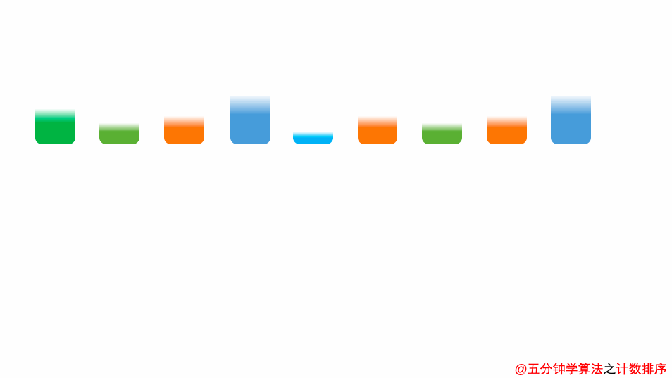

# 00 十大排序算法

> 本篇博客作为笔者学习算法的第一篇文章，由于笔者算法也是刚刚入门，如有写的不好的地方，敬请见谅。

## 简单排序算法

开始之前，先提供一个JavaScript版本的对数器，供写排序算法测试。

```js
// 测试的方法
function testMethod(arr) {
  
}

//正确的方法
function rightMethod(arr) {
  arr.sort((a, b) => a - b);
}

//随机数组生成器，size为最大长度，value为最大值
function generateRandomArray(size, value) {
  //生成长度随机的数组
  let arr = new Array(Math.floor((size + 1) * Math.random()));
  for (let i = 0; i < arr.length; i++) {
    arr[i] = Math.floor((value + 1) * ((Math.random() - 0.5) * 2));
  }
  return arr;
}

//拷贝数组方法
function copyArray(arr) {
  if (arr == null) {
    return null;
  }
  return [].concat(arr);
}

//比对方法
function isEqual(arr1, arr2) {
  if ((arr1 == null && arr2 != null) || (arr1 != null && arr2 == null)) {
    return false;
  }
  if (arr1 == null && arr2 == null) {
    return true;
  }
  if (arr1.length != arr2.length) {
    return false;
  }
  for (let i = 0; i < arr1.length; i++) {
    if (arr1[i] != arr2[i]) {
      return false;
    }
  }
  return true;
}

//测试
function Test() {
  let testTimes = 5000;
  let size = 10;
  let value = 100;
  let succeed = true;
  for (let i = 0; i < testTimes; i++) {
    let arr1 = generateRandomArray(size, value);
    let arr2 = copyArray(arr1);
    let arr3 = copyArray(arr1);
    testMethod(arr1);
    rightMethod(arr2);
    if (!isEqual(arr1, arr2)) {
      succeed = false;
      console.log(arr3);
      break;
    }
  }
  console.log(succeed ? 'nice' : 'Fucking fucked');
}

Test();
```

首先放上我们的万年swap函数：

```js
function swap(arr, i, j) {
  const temp = arr[i]
  arr[i] = arr[j]
  arr[j] = temp
}
```

### 1. 冒泡排序

```js
function bubble_sort(arr, left, right) {
  if (arr === null || arr.length < 2) return

  left = left || 0
  right = right || arr.length - 1
  for (let i = left; i <= right; i++) {
    for (let j = i + 1; j < arr.length; j++) {
      if (arr[i] > arr[j]) swap(arr, i, j)
    }
  }
}
```

通过排序可以看出冒泡排序的**比较次数都为（N-1）+（N-2）+ ... + 1 = （N-1）* N / 2次**，有一半的概率会发生交换，**交换的次数为（N-1）* N / 4次**。因此**时间复杂度为O(N²)，空间复杂度为O(1)，稳定**。

这里`arr[i]`和`arr[j]`之所以相等不交换，一方面是没必要，另一方面是保持排序的稳定性。那，什么是排序的稳定性呢？

排序的稳定性指的是数组中的**相同的元素排完序之后的相对次序不变**。


### 2. 选择排序

```js
function select_sort(arr, left, right) {
  if (arr === null || arr.length < 2) return

  left = left || 0
  right = right || arr.length - 1

  for (let i = left; i <= right; i++) {
    let min = i
    for (let j = i + 1; j < arr.length; j++) {
      if (arr[min] > arr[j]) min = j
    }
    swap(arr, i, min)
  }
}
```

相对于冒泡排序，选择排序用临时变量记录了最小值的索引，减少了一轮的交换次数，**略好于冒泡排序**。选择排序的比较次数为**（N-1）* N / 2次**，**交换次数为N次**。因此**时间复杂度为O(N²)，空间复杂度为O(1)，稳定**。


### 3. 插入排序

```js
function insert_sort(arr, left, right) {
  if (arr === null || arr.length < 2) return

  left = left || 0
  right = right || arr.length - 1

  for (let i = left + 1; i <= right; i++) {
    let j = i - 1
    let temp = arr[i]
    while (arr[j] !== undefined && arr[j] > temp) {
      arr[j + 1] = arr[j]
      j--
    }
    arr[j + 1] = temp
  }
}
```

插入排序的思想是**局部有序**，即从第二个元素开始，把前面所有的元素看为是有序的。然后找到大于等于自身值的第一个位置插入进去。

不同于前面的排序，插入排序的**比较次数和值的拷贝次数是取决于数据状况的**，数据越趋近于有序，时间复杂度越低。最好情况下时间复杂度为O(N)，此时数组为有序状态，最差为O(N²)，为逆序状态。因此，插入排序**时间复杂度为O(N²)，空间复杂度为O(1)，稳定，好于前两种算法**。


## 高级排序算法

### 4. 希尔排序

```js
function shell_sort(arr, left, right) {
  if (arr === null || arr.length < 2) return

  left = left || 0
  right = right || arr.length - 1

  let gap = Math.floor((right - left + 1) / 2)

  while (gap > 0) {
    for (let i = left + gap; i <= right; i += gap) {
      let j = i - gap
      let temp = arr[i]
      while (arr[j] !== undefined && arr[j] > temp) {
        arr[j + gap] = arr[j]
        j -= gap
      }
      arr[j + gap] = temp
    }
    gap = Math.floor(gap / 2)
  }
}
```

希尔排序是选择排序的加强版，但插入排序有一个问题就是：假设一个很小的数据项在很靠近右端的位置上，这里本来是比较大的数据项的位置，那么移动的次数就会变多，无限趋近于O(N²)。

希尔排序的改进策略是：选择合适的增量，不需要一个个移动中间的数据项，就可以把较小的数据项移动到左边。

比如一组数字：

```js
81, 94, 11, 96, 12, 35, 17, 95, 28, 58, 41, 75, 15.
```

希尔排序的做法:

1. 先让间隔为5, 进行排序。

   ```js
   (35, 81), (94, 17), (11, 95), (96, 28), (12, 58), (35, 41), (17, 75), (95, 15)
   ```

   排序后的新序列, 一定可以让数字离自己的正确位置更近一步。

2. 再让间隔位3, 进行排序。

   ```js
   (35, 28, 75, 58, 95), (17, 12, 15, 81), (11, 41, 96, 94)
   ```

   排序后的新序列, 一定可以让数字离自己的正确位置又近了一步。

3. 最后, 我们让间隔为1, 也就是正确的插入排序。这个时候数字都离自己的位置更近, 那么需要复制的次数一定会减少很多。

   


由上面可以看出，希尔排序的效率是好于插入排序的，而且是取决于增量的选取。但是, 它的效率证明非常困难, 甚至某些增量的效率到目前依然没有被证明出来。但是**经过统计, 希尔排序使用原始增量, 最坏的情况下时间复杂度为O(N²), 通常情况下都要好于O(N²)。空间复杂度为O(1)，稳定**。原始增量即为length/2。

**Hibbard 增量序列**

- 增量的算法为2^k - 1。也就是为1 3 5 7...等等。
- 这种增量的最坏复杂度为O(N^3/2), 猜想的平均复杂度为O(N^5/4), 目前尚未被证明。

**Sedgewick增量序列**

- {1, 5, 19, 41, 109, … }, 该序列中的项或者是9\*4^i - 9\*2^i + 1或者是4^i - 3\*2^i + 1
- 这种增量的最坏复杂度为O(N^4/3), 平均复杂度为O(N^7/6), 但是均未被证明。

总之, 我们使用希尔排序大多数情况下效率都高于简单排序, 甚至在合适的增量和N的情况下, 还好好于快速排序。

### 5. 归并排序

```js
function merge(arr, left, middle, right) {
  const result = []

  let i = left
  let j = middle + 1
  while (true) {
    if (i === middle + 1) {
      while (j <= right) result.push(arr[j++])
      break
    }
    if (j === right + 1) {
      while (i <= middle) result.push(arr[i++])
      break
    }
    
    // <=是为了稳定性
    if (arr[i] <= arr[j]) result.push(arr[i++])
    else result.push(arr[j++])
  }

  for (let i = left; i <= right; i++) {
    arr[i] = result[i - left]
  }
}

function merge_sort(arr, left, right) {
  if (arr === null || left >= right) return

  left = left || 0
  right = right || arr.length - 1

  // 这么做的目的是为了防止(left+right)超出边界
  const middle = Math.floor(left + ((right - left) >> 1))
  merge_sort(arr, left, middle)
  merge_sort(arr, middle + 1, right)
  merge(arr, left, middle, right)
}
```

归并排序采取了分而治之的思想，每次先对两边排序，再合并有序数组，然后递归该过程直到排序完成。递归的基础上再对有序数组进行合并操作，因此**时间复杂度为O(Nlog(N))，采用了辅助数组，空间复杂度为O(N)，稳定**。


### 6. 快速排序

对于快排，可以写出很多个版本，但我觉得最经典的还是荷兰国旗版本。所谓荷兰国旗：

> 拿破仑席卷欧洲大陆之后，代表自由，平等，博爱的竖色三色旗也风靡一时。荷兰国旗就是一面三色旗（只不过是横向的），自上而下为红白蓝三色。
>
> 该问题本身是关于三色球排序和分类的，由荷兰科学家Dijkstra提出。由于问题中的三色小球有序排列后正好分为三类，Dijkstra就想象成他母国的国旗，于是问题也就被命名为荷兰旗问题（Dutch National Flag Problem）。
>
> 下面是问题的正规描述： 现有n个红白蓝三种不同颜色的小球，乱序排列在一起，请通过两两交换任意两个球，使得从左至右，依次是一些红球、一些白球、一些蓝球。

我们**把荷兰国旗问题抽象成数组**的形式是下面这样的：

> 给定一个整数数组和一个值M（存在于原数组中），要求把数组中小于M的元素放到数组的左边，等于M的元素放到数组的中间，大于M的元素放到数组的右边，最终返回一个整数数组，只有两个值，0位置是等于M的数组部分的左下标值、1位置是等于M的数组部分的右下标值。

进一步**抽象为更加通用**的形式是下面这样的：

> 给定数组arr，将[l, r]范围内的数（当然默认是 [ 0 - arr.length - 1 ]），小于privot（随机选取的数组里的值）放到数组左边，等于arr[r]放到数组中间，大于arr[r]放到数组右边。最后返回等于privot的左, 右下标值。

```js
function quick_sort(arr, left, right) {
  if (arr === null || arr.length < 2 || left >= right) return

  left = left || 0
  right = right || arr.length - 1

  // 随机选取枢纽[left, right],然后和right交换
  swap(arr, right, left + Math.floor((right - left + 1) * Math.random()))

  // 根据枢纽把数组分为：[0,section[0]-1]小于枢纽，[section[0],section[1]]等于枢纽，[section[1]+1,right]大于枢纽
  const section = partation(arr, left, right)
  quick_sort(arr, left, section[0] - 1)
  quick_sort(arr, section[1] + 1, right)
}

function partation(arr, left, right) {
  let i = left - 1
  let j = right
  let k = left

  // [left, i]: 小于privot范围
  // [j, right]: 大于privot范围
  // [i+1,j-1]:等于privot范围
  while (k < j) {
    if (arr[k] > arr[right]) {
      swap(arr, --j, k)
    } else if (arr[k] < arr[right]) {
      swap(arr, ++i, k++)
    } else {
      k++
    }
  }
  swap(arr, right, j)
  return [i + 1, j]
}
```

快速排序的思路也是分而治之，随机选取枢纽，然后荷兰问题把数组划分为小于枢纽、等于枢纽、大于枢纽的部分。再对各部分排序直到有序。快速排序中荷兰问题因为会交换枢纽和大于枢纽的值，所以**不稳定**。快速排序递归的过程是二分，根据枢纽排序是O(N)，因此**时间复杂度为O(Nlog(N))，空间复杂度因为递归为O(log(N))**，实际上前面归并也有这个空间复杂度，只不过归并还有辅助数组O(N)。


### 7. 堆排序

```js
// 构建最大堆
function heap_sort(arr, left, right) {
  if (arr === null || left >= right) return

  left = left || 0
  right = right || arr.length - 1

  // 把[left,right]上的元素堆化
  // for (let i = left; i <= right; i++) {
  //   heap_insert(arr, i, left)
  // }

  // 因为堆是完全二叉树，所以必然有Math.floor((size+1)/2)个叶子节点，所以只需确保Math.floor(size/2)的位置正确，即只对前Math.floor(size)个元素进行heapify,就可以完成堆化。这样节省了操作，提高了一半效率。

  for (let i = Math.floor((right - left) / 2); i >= left; i--) {
    heapify(arr, i, right)
  }

  // 把最后的元素和堆顶交换，然后缩小堆(控制size)
  let size = right
  while (size >= left) {
    swap(arr, left, size)
    heapify(arr, left, --size)
  }
}

// 当前元素处于index,向上调整堆结构
function heap_insert(arr, index, root) {
  // root表示根所在的索引，pIndex表示父元素的索引
  let pIndex = Math.floor((index - 1) / 2)
  while (pIndex >= root) {
    if (arr[pIndex] >= arr[index]) break

    swap(arr, pIndex, index)
    index = pIndex
    pIndex = Math.floor((index - 1) / 2)
  }
}


// 当前元素处于index,向下调整堆结构,size表示数组堆结构的结束索引
function heapify(arr, index, size) {
  // left表示左孩子的索引
  let left = 2 * index + 1

  while (left <= size) {
    // 表示还有孩子,取孩子中最大值的索引
    let maxIndex = left + 1 <= size && arr[left] < arr[left + 1] ? left + 1 : left
	
    // 孩子都比自己小
    if (arr[index] >= arr[maxIndex]) return

    swap(arr, maxIndex, index)
    index = maxIndex
    left = 2 * index + 1
  }
}
```

堆排序有两个重要的操作：`heapify`和`heap_insert`。分别是对指定位置的元素进行向上或者向下移动来确保堆的结构稳定。因为堆是完全而叉树，因此我们**可把数组的一部分看作堆**，即[left,right]。`heap_insert`中，size表示堆结构在数组中的结束索引。

堆向上和向下移动的次数为树的深度，也就是`log(N)`，因此堆化数组时间复杂度为`O(Nlog(N))`

、交换堆顶和尾部元素也为`Nlog(N)`，故**堆排序的时间复杂度为O(Nlog(N))，空间复杂度为O(1)**，涉及到不同位置的交换，**不稳定**。


### 8. 计数排序

```js
// 不涉及比较的排序，都只适用于特定场景。比如计数只适用于小而密集的数据(比如统计员工年龄)
function count_sort(arr, left, right) {
  if (arr === null || arr.length < 2) return

  left = left || 0
  right = right || arr.length - 1

  // 用索引计数会出现负数的情况，可以用把绝对值最大的数和数组元素求和，排完序再减掉。
  let max = Math.abs(arr[left])
  for (let i = left + 1; i <= right; i++) {
    max = Math.max(max, Math.abs(arr[i]))
  }

  for (let i = left; i <= right; i++) {
    arr[i] += max
  }

  const help = new Array(2 * max + 1).fill(0)
  for (let i = left; i <= right; i++) {
    help[arr[i]]++
  }

  let k = 0
  for (let i = 0; i < help.length; i++) {
    while (help[i]-- > 0) arr[k++] = i
  }

  // 减去max
  for (let i = left; i <= right; i++) {
    arr[i] -= max
  }
}
```

用辅助数组下标记录元素值，值记录出现次数。但只适用于特定场景。比如小而密集的数。数据之间不密集，就会浪费很多无谓的空间。**时间复杂度为O(N)，空间复杂度为O(N)，稳定**。有点像`Hashmap`的链地址法。



### 9. 桶排序


### 10. 基数排序

```js
function maxbits(max) {
  // 计算一个数字有几位
  let k = 0
  while (max > 0) {
    max = Math.floor(max / 10)
    k++
  }
  return k
}

function getDigit(value, digit) {
  // 获取一个数字特定位置的值
  let target = 0
  while (digit > 0) {
    target = value % 10
    value = Math.floor(value / 10)
    digit--
  }
  return target
}

function radix_sort(arr, left, right) {
  if (arr == null || arr.length < 2) return
  left = left || 0
  right = right || arr.length - 1

  let max = Math.abs(arr[left])
  for (let i = left + 1; i <= right; i++) {
    max = Math.max(max, Math.abs(arr[i]))
  }
  for (let i = 0; i <= right; i++) {
    arr[i] += max
  }

  radixSort(arr, left, right, maxbits(2 * max))
  for (let i = 0; i <= right; i++) {
    arr[i] -= max
  }
}

function radixSort(arr, begin, end, digit) {
  // 从个位排到digit位,1代表个位
  let j = 0 // 表示arr数组元素在当前位的值（被用作count的索引）
  let i = 0 // 遍历数组arr的索引
  let radix = 10
  const bucket = new Array(end - begin + 1)
  for (let d = 1; d <= digit; d++) {
    // 用count数组的索引表示arr元素当前位(digit)的值，count数组索引对应的值表示arr数组当前位的值的出现次数；并构成前缀和数组
    const count = new Array(radix).fill(0)

    for (i = begin; i <= end; i++) {
      j = getDigit(arr[i], d)
      count[j]++
    }

    // 构建前缀和数组
    for (j = 1; j < radix; j++) {
      count[j] += count[j - 1]
    }

    // 按照d位从后往前排序
    for (i = end; i >= begin; i--) {
      j = getDigit(arr[i], d)
      bucket[--count[j]] = arr[i]
    }

    for (i = begin; i <= end; i++) {
      arr[i] = bucket[i - begin]
    }
  }
}
```


基数排序是对数组中的所有数字，从个位一直排到最高位。因此**时间复杂度为O(k*N)，其中k为最大的数有几位，空间复杂度为O(N + k)，稳定**。

代码中使用前缀和数组，是一种简化操作，利用了桶的**后入后出**特性，**每个count前缀和的值代表了有多少个元素比自己小**。

不基于比较的排序，应用场景都比较有限，比如当前数字如果很长，基数排序效果就没那么好了。在满足 `n>>k `条件的情况下，基数排序是最好的排序算法，**时间复杂度能达到O(N)，空间复杂度为O(N)**。

关于基数和桶排序的复杂度分析，可见[基数排序时间复杂度](https://zhuanlan.zhihu.com/p/341359046)。

## 总结

| 排序算法 | 平均时间复杂度 |  最好情况  |  最差情况  | 空间复杂度 | 稳定性 |
| :------: | :------------: | :--------: | :--------: | :--------: | :----: |
| 冒泡排序 |     O(N²)      |    O(N)    |   O(N²)    |    O(1)    |  稳定  |
| 选择排序 |     O(N²)      |   O(N²)    |   O(N²)    |    O(1)    | 不稳定 |
| 插入排序 |     O(N²)      |    O(N)    |   O(N²)    |    O(1)    |  稳定  |
| 希尔排序 |   O(Nlog(N))   | O(Nlog²N)  | O(Nlog²N)  |    O(1)    | 不稳定 |
| 归并排序 |   O(Nlog(N))   | O(Nlog(N)) | O(Nlog(N)) |    O(N)    |  稳定  |
| 快速排序 |   O(Nlog(N))   | O(Nlog(N)) |   O(N²)    |  O(logN)   | 不稳定 |
|  堆排序  |   O(Nlog(N))   | O(Nlog(N)) | O(Nlog(N)) |    O(1)    | 不稳定 |
| 计数排序 |     O(N+k)     |   O(N+k)   |   O(N+k)   |   O(N+k)   |  稳定  |
|  桶排序  |     O(N+k)     |   O(N+k)   |   O(N²)    |   O(N+k)   |  稳定  |
| 基数排序 |     O(n*k)     |   O(n*k)   |   O(n*k)   |   O(N+m)   |  稳定  |

